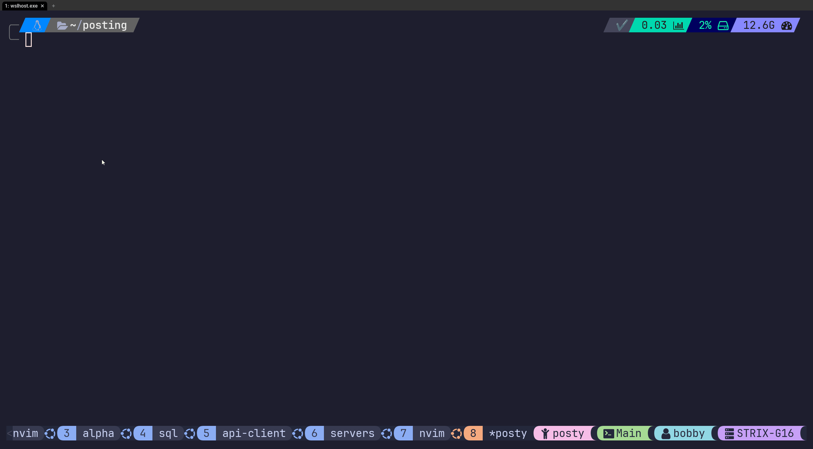

# posting-manager
A simple TUI to create and open posting collections

<br />

If you're using posting (posting.sh) you would notice it may be a bit cumbersome to manage multiple collections.
This terminal app provides an interface to select and create new collections without having to build a command with all of the necessary arguments.




<br />

## Setup
Set the `POSTING_ROOT` environment variable with the path that will hold all of your collections.
It's ideal to set this in your shell config script (for example .bashrc or .zshrc).
```bash
export POSTING_ROOT=/home/user/posting_collections/
```

<br />

Within this folder should exist subfolders which are your collections (if you have any).
Example:
```bash
posting_collections/
│
├── collection-001/
│   └── .env
│   └── collection-001.yaml
└── superapi/
    └── .env
    └── superapi.yaml
```

<br/>

## Creating a new collection
Creating a new collection will... 
- create a folder in your `POSTING_ROOT` dir with the name entered.
- create an `.env` file in your collection dir which can be use to hold any collection variables.
- Save an `API_KEY` variable and `BASE_URL` variable in your `.env` file based on the data inputted.

<br />

## Opening a collection 
Selecting an existing collection will start the posting app and...
- Set the `--collection` argument based on the collection selected.
- Set the `--env` argument using the `.env` file in the collection's directory.
- Set an additional `--env` argument to also load the `.shared.env` file if one exists in the `POSTING_ROOT` directory.
